# Lumen — a canvas that thinks with you

An AI-native infinite canvas built on the [Excalidraw](https://github.com/excalidraw/excalidraw) React component (MIT).
You sketch, drop notes, or paste text — and the canvas **understands what you made** and offers the next move *right where the
thing lives*. No chat sidebar. Rough ideas become structure, structure becomes something you can run.

```
npm install
npm run dev          # http://localhost:5173
```

It works **with no API key**. Add one (or deploy with a server key) and Claude takes over for generation, sketch-reading and bespoke apps.

---

## What's different from "whiteboard + chatbot"

| Idea | What it does |
| --- | --- |
| **The dock, not a chat box** | Select anything and a small dock appears *at the selection* with the verbs that make sense for **that** selection: notes → *Cluster*; an outline → *Structure it / Mind map*; a flowchart → *Make it run / Find gaps / Tidy up*; a lone sketch → *Make it real*. Free text is always one `/` away (or ⌘K). |
| **Results are canvas objects** | Answers become sticky notes tethered to their source, critiques become flags pinned next to the offending node, clusters become animated lanes. Everything is selectable, editable and undoable (`Undo` in the toast = the real Excalidraw history, one step per action). |
| **Live objects** | A diagram becomes a **working prototype on the canvas**: a flowchart turns into a walkable simulation (decisions become buttons), a list becomes a progress-tracking checklist, "pomodoro timer" / "poll" / "kanban" / "calculator"… become real tools. Live objects are sandboxed apps (`<iframe sandbox="allow-scripts">`, no same-origin) with a tiny bridge (`lumen.state` / `lumen.save`) so **their state is saved in the document**, synced and versioned like any other element. Select one to edit its code, open it full-screen, duplicate it — or tell Claude to change it. |
| **Deterministic intelligence, offline** | The offline engine isn't a stub: outline/indentation parsing, arrow syntax (`Idea -> Prototype -> Test`), decision/branch detection, topic-aware clustering (TF-IDF + a built-in topic lexicon + spatial proximity), graph linting (dead ends, decisions with one exit, loops with no exit, orphans, duplicates), doc generation, and board scaffolds (kanban, SWOT, retro, pros/cons, journey). |
| **Claude when you want it** | One tool-call contract (`canvas_plan`). Claude receives a *semantic* description of the canvas (items, text, positions, connections) **plus an image of the selection**, so it can read sketches and handwriting and build a bespoke working app from them. |
| **Safe by construction** | Model output is coerced through `sanitizePlan` into well-formed ops (unknown ops, dangling edges, oversize payloads dropped); apps run in an opaque-origin sandbox; the hosted proxy pins the model, caps tokens, whitelists fields and rate-limits. If Claude fails, the offline engine still answers. |
| **Never lose work** | Local-first projects (IndexedDB), autosave, multiple boards, and **version history** — Lumen checkpoints *before every AI action*, plus manual named checkpoints, with per-version diffs (`+3 −1 ~2`) and one-click restore (itself undoable). |
| **Serverless sharing** | *Copy share link* packs the whole board into the URL fragment (gzip + base64url). The fragment never reaches a server; opening it imports the board as a new local project — on any device. |
| **Any AI, or none** | Anthropic, OpenAI, Gemini, or any OpenAI-compatible endpoint (OpenRouter, Groq, Ollama, LM Studio). First-run popup is skippable; ✦ settings has *Test connection*. Keys stay in the browser. |
| **Mermaid in, native shapes out** | Paste/type Mermaid (or have a text block on the canvas offer *Draw this diagram*). Flowcharts are parsed natively into editable Lumen diagrams; sequence/class/ER/gantt use `@excalidraw/mermaid-to-excalidraw` (lazy-loaded). |
| **On-device OCR** | *Read text* on any image/sketch uses Tesseract (WASM, self-hosted, no network, no key) and drops the text on the canvas as a note you can then structure, cluster or mind-map. |
| **Live rooms across devices** | *Share live…* gives a private room link; a tiny stateless relay (`server/relay.mjs`) forwards messages, and merging stays client-side via Excalidraw's `reconcileElements`. Same-browser tabs sync with no server. |
| **Installable & offline** | A PWA: install it from the browser, and after one visit the whole app (and anything you've used, e.g. OCR or Mermaid) works with no connection. |
| **Real code editor** | Live objects and documents open in CodeMirror 6 (syntax highlighting, dark mode) with a live preview. |
| **Present** | Menu → *Present*: your frames become slides (←/→, Esc), all chrome hidden. No frames? It presents the whole board. |
| **Rough → refined** | *Clean up* turns wobbly freehand rectangles, circles, diamonds and lines into crisp shapes (pure geometry, on-device) and un-sketches existing shapes. One Undo restores your strokes. |
| **Voice** | A 🎙 button in the dock (where the browser supports speech recognition): talk, and the canvas acts when you stop. |
| **Export & interop** | Markdown, **JSON Canvas** (import + export — the open format Obsidian Canvas uses; groups ⇄ frames, edges ⇄ bound arrows), and any live object as a standalone `.html` that runs by itself. |
| **Data objects** | Drop a `.csv`/`.tsv`, paste a table into the prompt, or pick *Add data…*: you get a live **chart + table** (bar/line/pie auto-chosen, sortable columns, summary stats; choices are saved). Select CSV text on the canvas and *Chart this data* appears. |
| **Agents as collaborators (MCP)** | *Connect an AI agent…* shows a ready-to-paste MCP config. Claude Desktop, Cursor or Claude Code join the board's live room as a peer: `read_board`, `add_notes`, `add_diagram`, `add_mermaid`, `add_data`, `add_doc`, `add_app`, `apply_plan`. Their changes are applied by an open browser, checkpointed, undoable and visible to everyone. |
| **⌘K & templates** | A command palette for everything (anything unmatched runs as a prompt) and a 9-template gallery (Kanban, SWOT, retro, pros/cons, priority matrix, meeting notes, weekly planner, start-stop-continue, user journey). |
| **Image tools** | Select an image: **Remove background** (one click — flood-fills the backdrop from the edges so light details *inside* the subject survive, feathers the edge, and crops the box tight so you can drag the subject anywhere), **Edit image** (brightness/contrast/saturation/blur, B&W/sepia/vivid/fade/invert, rotate/flip, live preview, one undo), and **Palette** (dominant colours → swatches). All on-device, no AI. |
| **PDF export** | One page per frame (or the whole board). |
| **Collab-ready architecture** | A `SyncAdapter` interface. Today's adapter is `BroadcastChannel`: live multi-tab collaboration with presence and cursors, using Excalidraw's `reconcileElements` for conflict-free merges. A WebSocket / Yjs adapter is a drop-in (`src/store/sync.ts`). |

---

## Foundation decision

| Candidate | License | Verdict |
| --- | --- | --- |
| **Excalidraw** (`@excalidraw/excalidraw` 0.18) | **MIT** | ✅ Chosen. Mature drawing engine, hand-drawn aesthetic, embeddables, bound arrows/text, history, collab-grade element reconciliation, touch support. |
| tldraw 5 | custom ("SEE LICENSE") — production use requires a license key | ❌ Not a permissive foundation for an open deployable product. |
| AFFiNE | MIT core + enterprise-licensed pieces; heavyweight monorepo (BlockSuite, Rust/Electron toolchain) | ❌ Wrong shape for "a React component deployable to Vercel". Studied for its docs+canvas+edgeless-mode ideas (documents as first-class canvas objects → Lumen *doc cards*). |
| Mermaid → Excalidraw | MIT | Not needed: Lumen has its own typed diagram op + `dagre` layout (MIT) with correct arrow geometry and bindings. |

Runtime dependencies: `react`, `@excalidraw/excalidraw`, `@dagrejs/dagre`, `idb-keyval`. Everything else is in `src/`.

---

## Architecture

```
src/
  ai/
    schema.ts      Plan/Op contract + sanitizePlan (the only thing engines must produce)
    intents.ts     selection → suggested verbs; prompt → intent classifier
    local.ts       offline engine (outline, arrows, clustering, review, docs, scaffolds, app picker)
    claude.ts      tool schema, system prompt, payload (+ selection image), BYO-key and proxy transport
    engine.ts      routing: Claude → fallback offline
    settings.ts
  canvas/
    context.ts     elements → semantic graph (notes/shapes/edges), outline parsing, graph review
    layout.ts      dagre flow/tree + custom mind-map layout, text measurement
    execute.ts     Plan → elements; animated moves; arrow re-routing; bound-text carrying
    placement.ts   find free space for new content
    palette.ts
  live/
    runtime.ts     sandbox document composer, state bridge, safe Markdown
    templates.ts   flow runner, checklist, todo, counter, timer, calculator, poll, kanban, tip, dice, signup
    LiveObject.tsx renderEmbeddable target + registry that routes iframe saves to elements
  store/
    projects.ts    IndexedDB projects, versions, diffs, autosave
    share.ts       board ⇄ URL-fragment links (gzip + base64url)
    sync.ts        SyncAdapter + BroadcastChannel implementation
  ui/              Dock, panels (history, settings, code editor, project menu, welcome)
  App.tsx          workspace orchestration
api/
  _core.ts         Claude proxy logic (shared by Vercel + dev server)
  ai.ts            Vercel serverless function
e2e/               Playwright suites (drawing, intents, live objects, persistence, collab, mobile, Claude)
```

The key seam is the **Plan**: `{ say, ops[] }` with ops `diagram | notes | board | cluster | app | doc | answer | flag | connect | relayout | restyle | delete`.
Engines produce plans; `execute.ts` turns them into canvas elements (one history entry per plan, animated moves folded in via `CaptureUpdateAction.EVENTUALLY`).

---

## AI providers (all optional)

Open ✦ → pick **Claude / GPT / Gemini / Custom**, paste a key, *Test connection*. Defaults: `claude-sonnet-5-5`, `gpt-4o`, `gemini-2.5-flash` — edit the model field freely. *Custom* takes any OpenAI-compatible base URL (e.g. `https://openrouter.ai/api/v1`, `http://localhost:11434/v1` for Ollama; key optional locally).

1. **Your own key** — stored in `localStorage`, sent straight from your browser to the provider.
2. **Hosted** (Anthropic only) — set `ANTHROPIC_API_KEY` (and optionally `LUMEN_MODEL`) in Vercel; the browser never sees it. `api/_core.ts` pins the model, caps tokens, whitelists fields and rate-limits per IP.
3. **Offline** — nothing leaves the device; "Stay offline" enforces it.

Every provider gets the same canvas context, selection image and `canvas_plan` tool; adapters live in `src/ai/providers.ts`. If a provider call fails, the offline engine still answers.

## Agent bridge (MCP)

```
LUMEN_RELAY=wss://your-relay LUMEN_ROOM=<room id> node server/mcp.mjs     # stdio MCP server
```
Menu → *Connect an AI agent…* creates the room and prints the exact config for your MCP client. The agent never touches your files or API keys: it reads the board from the room's sync messages and *asks a browser* to apply plans (same ops as Lumen's own AI). Exactly one open tab applies each plan; if nobody has the board open the tool returns a clear error. Needs the relay below.

## Live collaboration relay

```
npm run relay                      # ws://localhost:8787  (PORT to change)
```
Deploy `server/relay.mjs` anywhere that runs Node + WebSockets (Render, Fly.io, Railway, a VPS — **not** Vercel functions). Then set its `wss://` address in ✦ settings (or `VITE_COLLAB_URL` at build time) and use menu → *Share live…*. The relay keeps no state and no boards; a late joiner receives the board from a connected peer, so someone must be online. Room links are unguessable bearer URLs — treat them as private. There is no auth yet.

## Deploy to Vercel

```
npx vercel          # framework: Vite, build: npm run build, output: dist (see vercel.json)
```
Set `ANTHROPIC_API_KEY` in the project's environment variables to enable the hosted engine. Excalidraw's fonts are self-hosted (copied to `public/fonts` on install/build) — no third-party CDN is contacted.

---

## Screenshots (captured by the e2e suite)

| | |
| --- | --- |
| 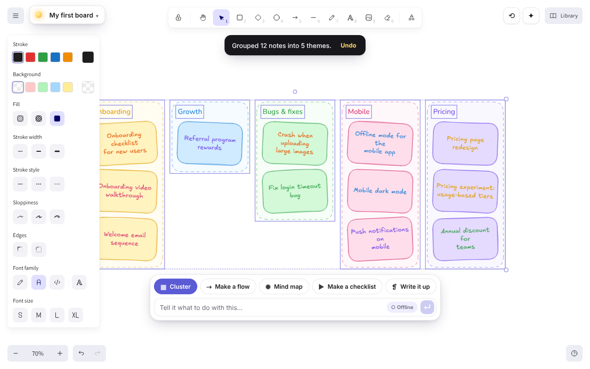 | 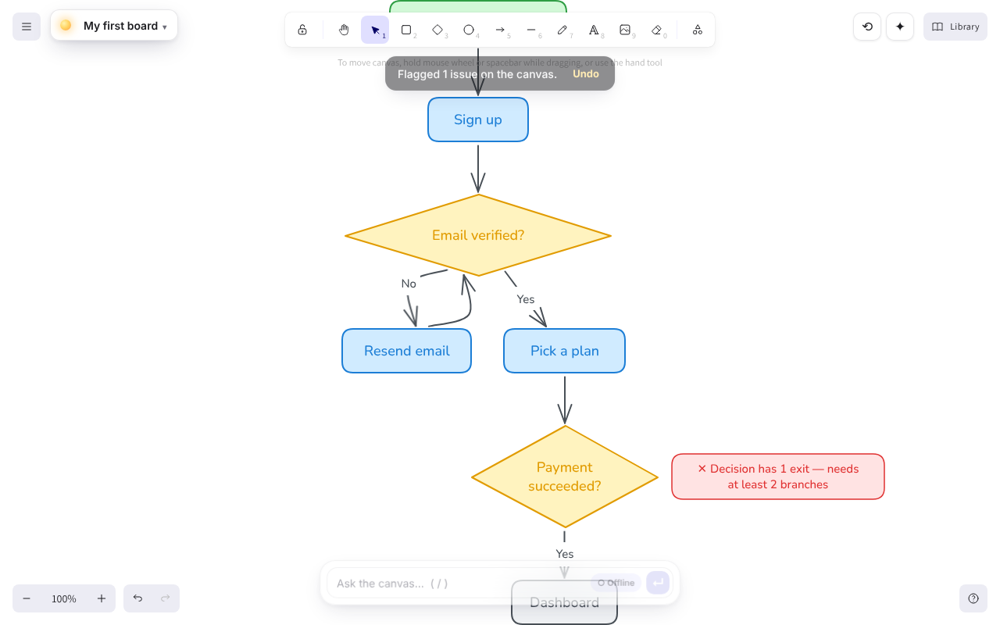 |
| 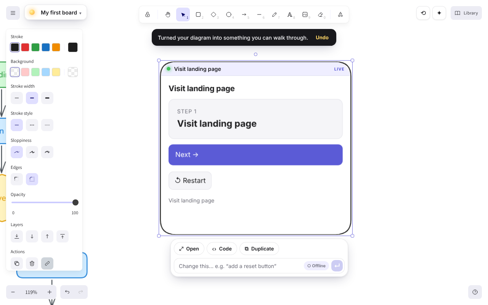 | 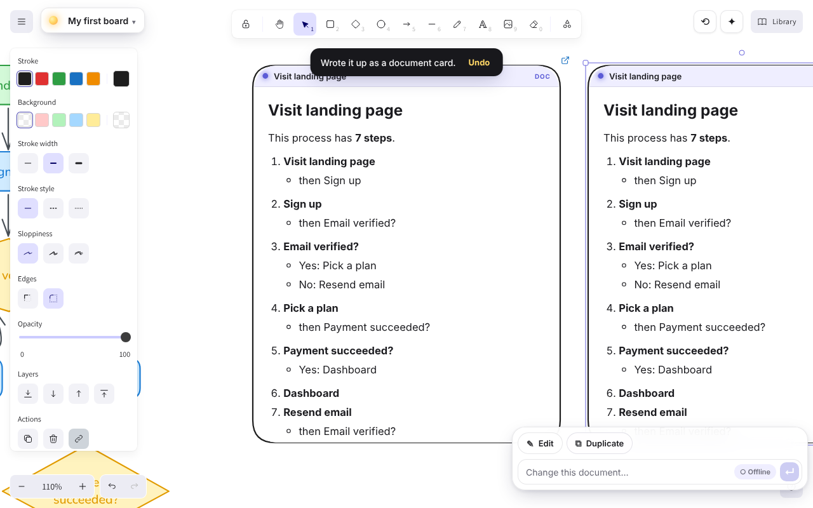 |
| 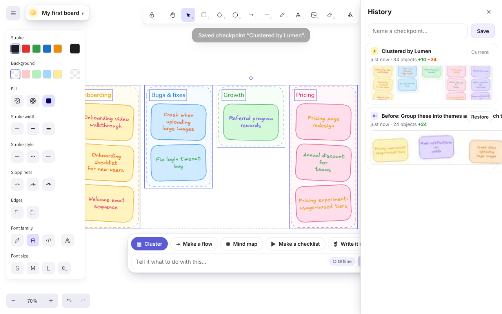 | 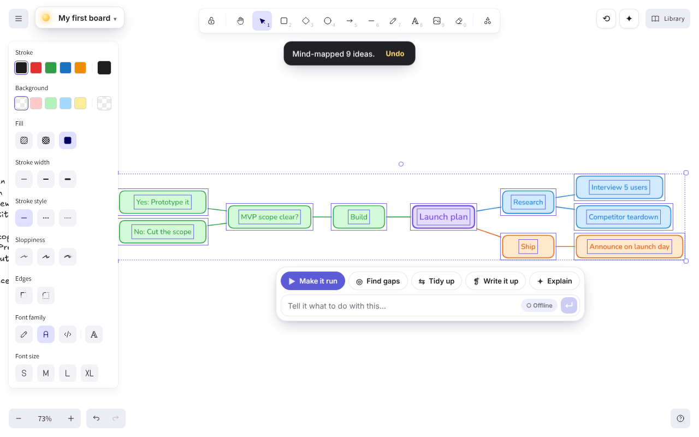 |
| 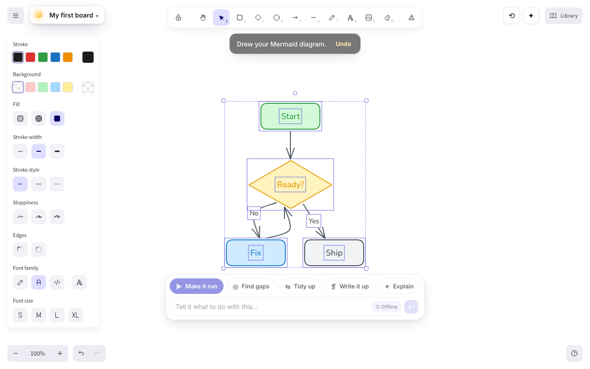 | 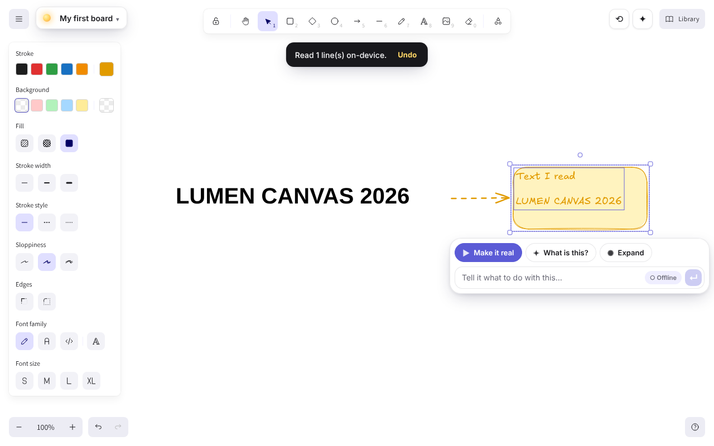 |
| 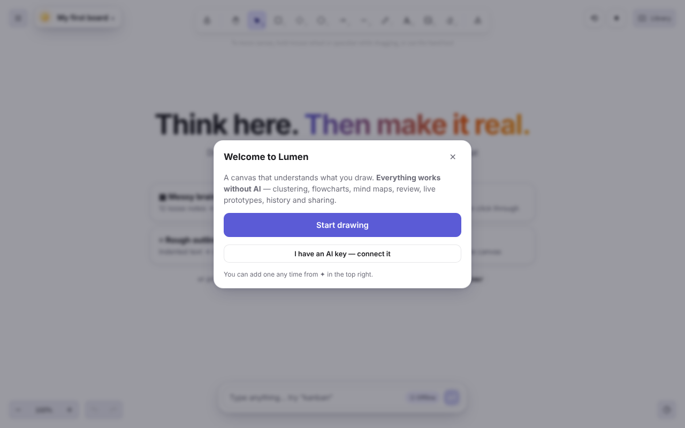 | 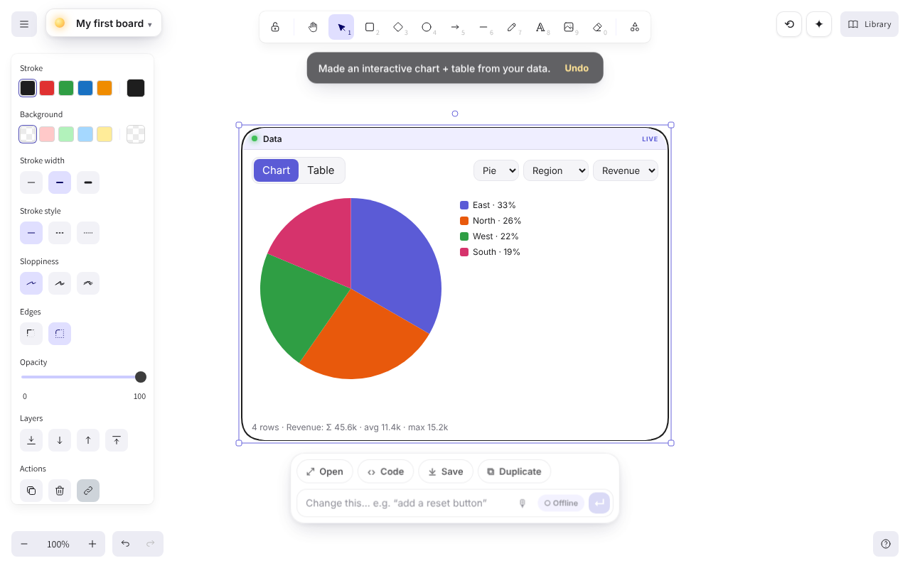 |
| 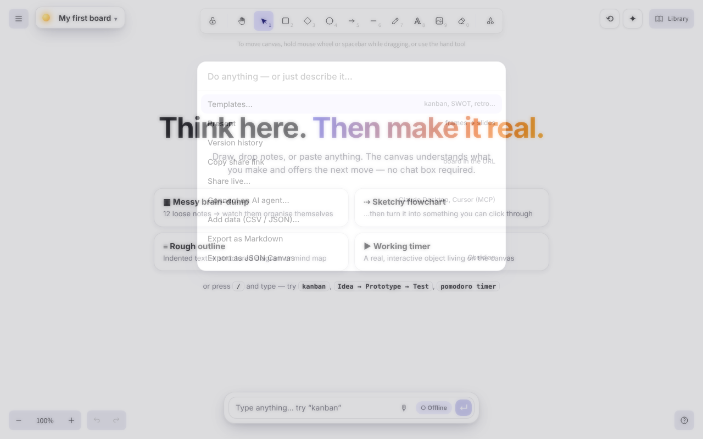 | 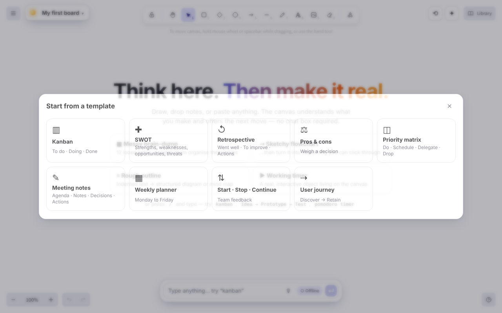 |
| 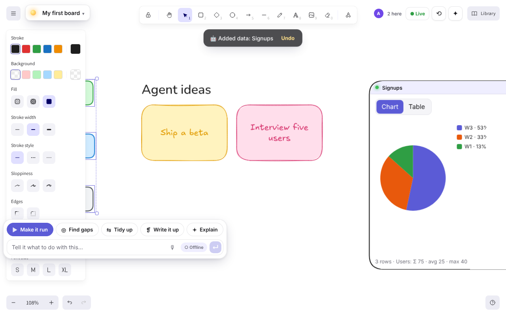 | 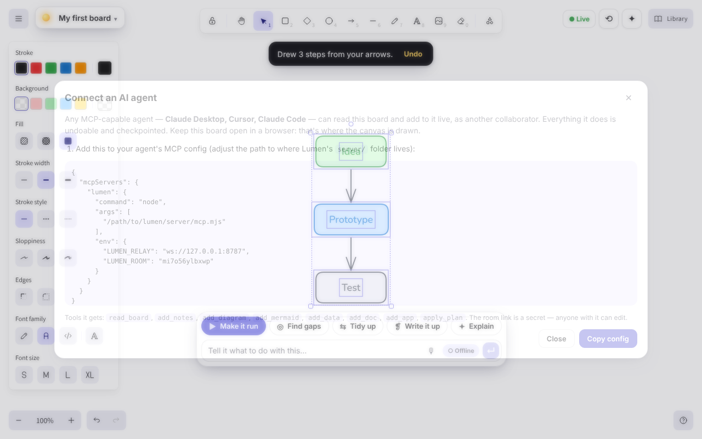 |

Phone (390px): 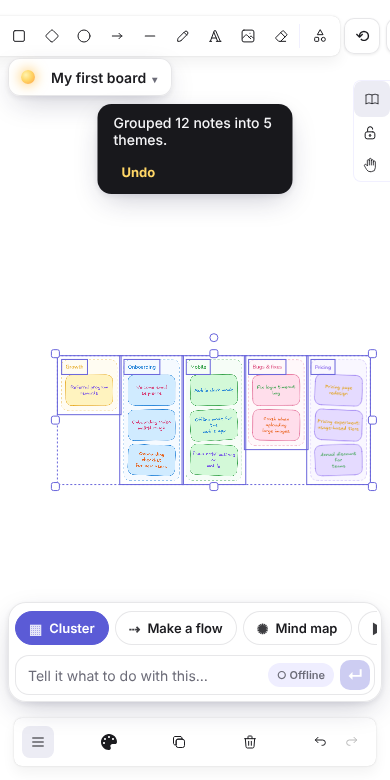

## Tests

```
npm test            # 56 unit tests (+ relay, MCP summariser): planner, clustering, review, layout, placement, markdown, share links, schema sanitising, store, proxy, Claude payload
npm run e2e         # 56 Playwright tests (incl. a real MCP client over stdio) (builds, serves, drives real Chromium): see e2e/*.spec.ts
```

The e2e suite exercises real pointer drawing, every intent chip, undo, animated clustering, live-object interaction **inside the sandboxed iframe** (state round-trips into the element), sandbox isolation, reload persistence, version restore, multi-project switching, two-tab collaboration, a 390px touch viewport, and the Claude paths with the network mocked at the edge (BYO key payload incl. selection image, hosted proxy, graceful fallback, in-place app editing).

## Known limitations (honest list)

- **Offline engine can't invent knowledge or read freehand sketches.** It restructures, clusters, lints and builds from what's labelled. Generation and sketch-to-app need Claude.
- **Live rooms need you to host the small relay** (not included in the Vercel deploy) and have no auth; if all peers leave, the board lives only in their local copies.
- **OCR is best on printed text/screenshots**; handwriting is unreliable offline (an AI key reads it much better).
- Live objects can't make network calls (sandbox + no external resources by design) and keep state as JSON ≤ 400 KB.
- Auto-layout is dagre/mind-map based; very large graphs (>80 nodes) are truncated by `sanitizePlan`.
- Excalidraw's own side panel overlaps the canvas on selection (upstream behaviour); the dock repositions around it but can't move it.
- The hosted proxy's rate limit is per-instance memory (use a durable store for strict limits).
